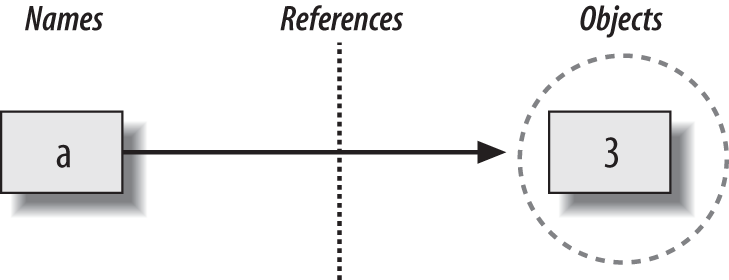
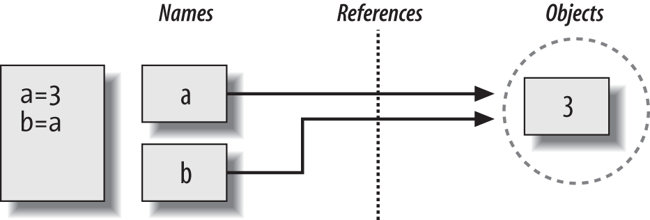
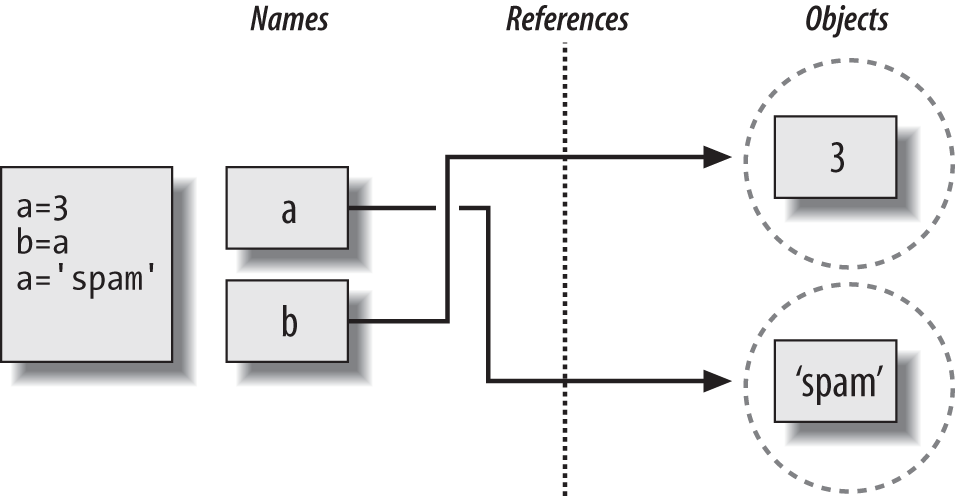

# The Dynamic Typing Interlude

타이핑이란 프로그램 내에서 변수의 데이터 타입을 정의하는 것으로, 데이터 타입 지정(assign)은 데이터 타입을 미리 선언하는 정적(static) 또는 프로그램 실행 시에 타입을 체크하는 동적(dynamic) 타이핑으로 분류한다. 파이썬은 동적 타이핑 언어로, 데이터 타입을 동적으로 변경할 수 있고, 메모리 할당 역시 프로그램 실행 시 자동으로 이루어진다.
```python
a = 3 # 변수의 타입을 미리 지정하지 않아도 된다.
type(a) # int
```
## 변수 선언문 누락
C, C++ 또는 자바를 사용해 봤다면, Python에서 변수의 타입을 선언하지 않는 것에 혼란스러울 수 있다. Python은 어떻게 변수의 타입을 감지할 수 있을까.

Python에서 자료형은 정적으로 선언되는 것이 아니라 런타임에 자동으로 선언된다.

### 변수, 객체, 참조

<table>
    <tr>
        <th>
            변수 생성
        </th>
        <td>
            변수는 코드에서 처음 값을 할당할 때 생성된다. 이후에 할당이 이루어지면, 이미 생성도된 변수의 값이 변경된다.
        </td>
    </tr>
    <tr>
        <th>
            변수 타입
        </th>
        <td>
            변수에는 타입이나 제약 조건이 없다. 타입은 변수명이 아닌 객체로 존재한다. <b>파이썬의 변수는 본질적으로 <code>generic</code>이기 때문에 항상 특정 시점에 특정 객체를 참조한다.</b>
        </td>
    </tr>
    <tr>
        <th>
            변수 사용
        </th>
        <td>
            특정 식에 변수를 입력하면 변수는 현재 참조하고 있는 객체로 즉시 대체된다. 이렇게 변수를 사용하기 위해서는 반드시 미리 값을 할당해야 하며(초기화), 값이 할당되지 않은 변수를 사용하면 <code>referencing unassigned error</code>가 발생한다.
        </td>
    </tr>
</table>

결과적으로, 아래 그림과 같이 개념을 정리할 수 있다. 변수 *Names*는 `generic` 으로서 미리 타입을 선언하지 않은채로 *Objects*를 *참조*하므로써 연결된다. 파이썬에서는 이러한 연결을 참조라고 부르는데, 이것은 메모리에서 포인터로 구현되는 일종의 연관성이라고 할 수 있다.


- 변수 : 시스템 테이블의 엔트리, 객체로 연결되는 공간.
- 객체 : 메모리가 할당된 조각, 객체가 가진 값을 표현하는 공간.
- 참조 : 자동으로 변수에서 객체로의 연결을 따르는 포인터.

### Types Live with Object, Not Variables
간단하게, Python에서 자료형은 변수가 아니라 객체와 함께 사용된다. 변수는 단지 이를 참조하는 것이다.

각 객체는 객체의 타입을 지정하는 헤더를 포함하고 있고, 
결국 자료형은 변수가 아니라 Python의 객체와 연결된다. 일반적으로 코드 상의 변수는 한 가지 종류의 객체만 참조한다.
### Objects Are Garbage-Collected
그렇다면 기존에 특정 객체를 참조하던 변수를 다른 값으로 재할당하면 어떻게 될까.
Python에서는 변수가 새로운 객체에 할당될 때마다, 즉 참조를 잃으면 객체는 가비지 컬렉션이라는 곳으로 회수된다.

```python
x = 42
x = 'shrubbery'     # 42 회수
x = 3.1415          # 'shrubbery' 회수
x = [1, 2, 3]       # 3.1415 회수
```
1. `x`는 매번 다른 타입의 객체를 할당 받는다. 이는 실제로 `x`의 타입이 변경된 것은 아니지만, 그와 같은 효과가 있다.
2. 객체에 대한 참조가 유실되면 가비지 컬렉터는 이 객체를 특정 공간으로 회수한다. 즉 객체의 공간이 자동으로 빈 공간 풀로 던져져 미래에 재사용된다.

내부적으로 Python은 현재 해당 객체를 가르키는 참조 수를 추적해 모든 객체 수를 유지하므로써 이러한 기능을 수행할 수 있다. 이 카운트가 0으로 떨어지면 자동으로 메모리 공간으로 회수된다.

이것의 가장 큰 이점은 스크립트에서 직접 공간을 할당하거나 확보할 필요없이 자동으로 이 과정이 이루어진다는 것이다.

> ### Python Garbage Collection
> 엄밀하게 말하자면, Python 가비지 컬렉션은 주로 참조 카운터를 기반으로 한다. 그러나 주기적 참조로 개체를 검색하고 시간내 회수하는 구성요소도 있다. 이는 기본적으로 활성화되어 있으며 임의로 비활성화 할 수 있다.
> 
> 주기적 참조는 참조 카운터 기반 가비지 컬렉션의 오래된 이슈이다. 참조는 포인터로 구현되므로 객체가 자신을 참조하거나 다른 객체를 참조할 수도 있다.`L.append(L)`이는 참조 카운터가 0으로 떨어지지 않기 때문에 특별한 처리가 필요하다.

## Shared References
하나의 객체를 여러 변수가 참조하거나 상호작용하는 과정을 기술적으로 살펴보면 아래 그림과 같다.


Python에서 여러 변수가 동일한 객체를 참조하는 경우, 일반적으로 공유 참조(공유 객체)라고 부른다. 이러한 경우, 그림의 `a` 와 `b`는 서로 직접 연결되지 않지만, 동일한 객체를 가르킨다.



다른 언어와 달리 Python의 변수는 메모리 영역이 아닌 객체에 대한 포인터이다. 변수가 새 값을 할당 받으면 객체가 다른 객체로 바뀌는 것이 아니라 다른 객체를 그저 참조하는 것이다.

### Shared References and In-Place Changes
Python에 대해 잘 이해하기 위해서는 참조에 대해 이해하고 있어야 한다.
```python
L1 = [2, 3, 4]
L2 = L1
```
2, 3, 4를 포함하는 `L1`리스트에서 `L[0]`은 정수형 객체 `2`를 참조한다(물론 리스트도 객체이다.) `L2 = L1` 구문으로 `L2`도 `L1`과 같은 객체를 참조한다(공유 객체).
```python
L1 = 24
```
위 할당으로, L1은 다른 객체, 정수형 객체 `24`를 참조하게 되었다.
```python
L1 = [2, 3, 4]  # A mutable object
L2 = L1         # Make a reference to the same object
L1[0] = 24      # A in-place change
```
```python
L1
# [24, 3, 4]
```
```python
L2
# [24, 3, 4]
```
예상하는 바는, `L1 = 24`, `L2 = [2, 3, 4]`겠지만, 완전히 다른 결과가 나온다. 이러한 현상은 인플레이스 변경을 지원하는 가변 객체에서 발생한다.

따라서 Python에서는 리스트를 복사하는 다른 다양한 방법을 제공한다. 일반적으로는 처음부터 끝까지 슬라이스 하는 방법이 쓰인다.
```python
L1 = [2, 3, 4]
L2 = L1[:]      # L1 복사하기
L1[0] = 24
```
```python
L1
# [2, 3, 4]
L2
# [2, 3, 4]
```

### Shared References and Equality
## Dynamic Typing is Everywhere
동적 타이핑에 대한 설명이 추상적이라 이해하기 어려울 지 모르지만, 결국 Python을 계속 한다면 관심을 가지게 될 부분이다. Python에서는 모든 것이 할당과 참조에 의해 작동하기 때문에 이 모델에 대한 이해는 다른 맥락에서 유용하다. 루프 변수, 모듈 가져오기, 클래스 속성, 함수 매개변수, 선언(할당)상태 등 모두 동일하게 작용한다. 이것이 어렵게 느껴질 지 몰라도, 이는 Python의 모든 곳에서 동일하게 작동하는 내용이다.

Python의 동적 타이핑이 가장 실용적인 부분은 코드를 줄여주는 것이다. 나아가 이 원리는 Python 다형성의 근원이 된다. 이 유형을 제한하지 않는 유연성은 시스템에 스스로 적응하는 코드를 생성할 수 있도록 도와준다.

### *약한* 참조
Python에서 "약한 참조"란 `weakref` 표준 라이브러리 모듈에 의해 구현된다. 이는 참조된 객체가 가비지 컬렉션에 의해 회수되는 객체로부터 참조되는 것을 스스로 방지하지 않는 객체다. 이는 딕셔너리 기반 캐시 객체에게 유용할 수 있다고 한다.([약한 참조에 대해 알아보자](https://developer88.tistory.com/115))